

# Firmware Overview

An overview of the firmware is shown below.
The power controller state machine and fault handler are executed every 100us by the scheduler. So also are the GUI handler (every 10ms), and the LED and Fan execution and temperature checking (every 100ms).

There is one interrupt source.

- <b>ControlLoop_Interrupt_CallBack</b>: executed every 10us. Voltages and currents in teh DAB board is being measured by ADC and feed to the control loops. There are three control loops in this implementation where Voltage loop and Power loop are executed every 10KHz, interleaved, while Current Loop is executed every 100KHz.

  

    
     
    Firmware overview.
  

Microchip Code Configurator (MCC) is used to configure the peripherals. They are configured at run-time at the start of _main()_ function, before the background loop is initiated.

The task files are as follows:
- _app/app_PBV_CAN.c_ : Contains the objects and functions for CAN communication.
- _app/app_PBV_config.c_ : Configures the list of functions that needs to be executed when Power Board Visualizer (PBV) use CAN communication or Uart communication.
- _app/app_PBV_dab_frame_map.c_ : User configuration for data that will be transmitted and received to/from Power Board Visualizer.
- _app/app_PBV_interface.c_ : Contains generic communicationfunctions for Power board Visualizer.
- _app/app_PBV_UART.c_ :  Contains the objects and functions for CAN communication.
- _device/dev_current_sensor.c_ : Contains function that measures the current sensor offset.
- _device/dev_fan.c_ : Contains functions that initialize and changes the speed of the fan.
- _device/dev_led.c_ : Contains LED functions that gives the user an indication of the current state of the power converter. 
- _device/dev_temp.c_ : Contains the temperature indication and calculation for the actual board temperature.
- _fault/dev_fault.c_ : Contains the fault initialization, execution and fault handling. 
- _fault/dev_fault_common.c_ : Contains generic fault functions for handling fault events.
- _power_control/dev_pwrctrl_.c_ : Contains power control initialization including control loop initialization and start-up initialization, and the power control execution. 
- _power_control/dev_pwrctrl_isr.c_ : Contains Control loop interrupt Callback that acquires the ADC raw data and process it in the control loop, and use the control output for the PWM distribution for this converter
- _power_control/dev_pwrctrl_pwm.c_ : Contains DAB control phase calculation between primary and secondary, and the PWM distribution.
- _power_control/dev_pwrctrl_sm.c_ : Contains power control state machine that is executed every 100us.
- _power_control/dev_pwrctrl_utils.c_ : Contains generic functions that handles power control ramp Up/Down and, the averaging generic fucntion.

  

    
     
    Firmware block diagram.
  

We now will go into more detail on certain parts of the firmware project that we deemed important and/or difficult to understand.

[[back to top](#start-doc)]

- - -

# Converter State Machine

The main power controller state machine is illustrated below. It is executed every 100us. 
The code is located in _pwrctrl/dev_pwrctrl_sm.c_, see the function Dev_PwrCtrl_StateMachine(POWER_CONTROL_t* pcInstance). 
During execution, the state machine goes through the following steps in chronological order.

#### Operating States
- _PWRCTRL_STATE_INITIALIZE_ : This state resets the conditional flag bits, ensures PWM output is disabled and run the initial current calibration offset. After this, the 
state machine moves to checking the fault handler.
- _PWRCTRL_STATE_FAULT_DETECTION_ : This state checks if there is fault event that occurred. When  there is no fault event, the state machine moves to StandBy state. 
- _PWRCTRL_STATE_STANDBY_ : This state waits until there is no fault event that has occurred and when the power control enable bit is set. When Enable bit is set, then this state reset the fault objects status bits, reset PWM control settings, enable the power control running bit, enable PWM physical output, initialize control loop references and then move to the soft start state.
- _PWRCTRL_STATE_SOFT_START_ : This state gradually ramps up/down the references of the power control. The control loop references are gradually incremented/decremented until in reached the desired control reference. When this is achieved, the next state will be assigned to state online. 
- _PWRCTRL_STATE_ONLINE_ : Once the start procedure has been completed successfully, the converter state machine drops into constant regulation mode, where it will remain until the converter is shut-down or suspended. During constant regulation the control reference is monitored. If the value of the control reference is changed, the state machine will tune into the new reference by generating a defined transition ramp using the ramp slope specified in the startup ramp timing.

  

    
     
    Power supply state machine.
  

[[back to top](#start-doc)]

- - -

# Fault Protection

The fault protection code is executed every 10us in theinterrupt service routine in the function _Dev_Fault_Execute()_. The body of the fault code is located in the files _device/fault/dev_fault.c_.

There are two types of protection:

1. Firmware fault protection
2. Hardware fault protection

The firmware fault protection is implemented on the dsPIC on the DP-PIM. The hardware fault protection is implemented on the DAB power board. It's purpose is to prevent catastrophic board damage, particularly due to input and output over current events.

[[back to top](#start-doc)]
- - -

## Firmware Fault Protection

All of our firmware fault protection has the same functionality. Each fault has a trigger threshold, a clear threshold, a fault blanking time and a fault clear time.

This is illustrated below, for a fault with a "max" threshold, which means that the fault is triggered when the fault source is above a threshold (output over voltage protection, for example).

Once the fault source breaches the trigger threshold, a timer is started. If the fault source stays above the trigger threshold for longer than the fault blanking time, then the fault becomes active, which means that the PWMs are switched off and the converter state machine is set to the "FAULT ACTIVE" state.

If the fault source drops back below the trigger threshold before the fault blanking time has expired, the timer is reset.  

When the fault is active, if the fault source stays below the fault clear threshold for the duration of the fault clear time, then the fault is cleared. When all fault sources are cleared, the converter will attempt to restart.

  

    
     
    Firmware Fault protection.
  

This is shown in more detail in a flowchart below. When "fault active == true", then the fault is active and the converter is disabled. When "fault active == false" the converter can attempt to start up.

  

    
     
    Flowchart illustrating the firmware fault protection.
  

All faults shown in the table below have firmware protection like this. In our firmware, this fault protection is run every 10us.

  

    
     
    DAB faults with firmware protection.
  

[[back to top](#start-doc)]
- - -

## Hardware fault protection

The purpose of the hardware fault protection is to prevent catastrophic board damage, particularly from input or output over current.
Once triggered, it kicks in immediately (there is no fault blanking time). It sets all PWM drive signals to 0, which will turn off the converter. Note that this is completely independent of the dsPIC, so even if there are drive signals coming from the dsPIC when the hardware fault protection is tripped, the hardware protection will over-ride these signals (through AND gates on the hardware) before they get to the FET drivers.

  

    
     
    ILLC faults with hardware protection.
  

If the hardware fault protection is triggered, the red LED LD700 will turn on. The protection is latched, meaning that once triggered it will not clear itself, it needs to be manually cleared.

If you want to re-run the board, you need to

- disable all PWMs first, either by holding down the RESET push button, or erasing the dsPIC firmware (we recommend the second option as it is safer)
- then short press the "RESET protection" push button on the HMI interface.

On the dsPIC, output over current protection using comparators and DACs is also implemented as follows:

- Current transformer phase A secondary sense tied to CMP1DAC (pin 22 of dsPIC)
- Current transformer phase B secondary sense tied to CMP3DAC (pin 18 of dsPIC)

Either of these comparators tripping will trigger the highest priority interrupt, which disables all PWM drive signals and puts the converter in the "FAULT ACTIVE" state.
Like the hardware fault protection, this fault protection is also latched, meaning that the dsPIC needs to be reset to restart the converter. If this fault protection is triggered, the RESET flag in the Power Board Visualizer GUI will be set, as shown below, indicating that the dsPIC needs to be reset to re-start the LLC converter.

  

    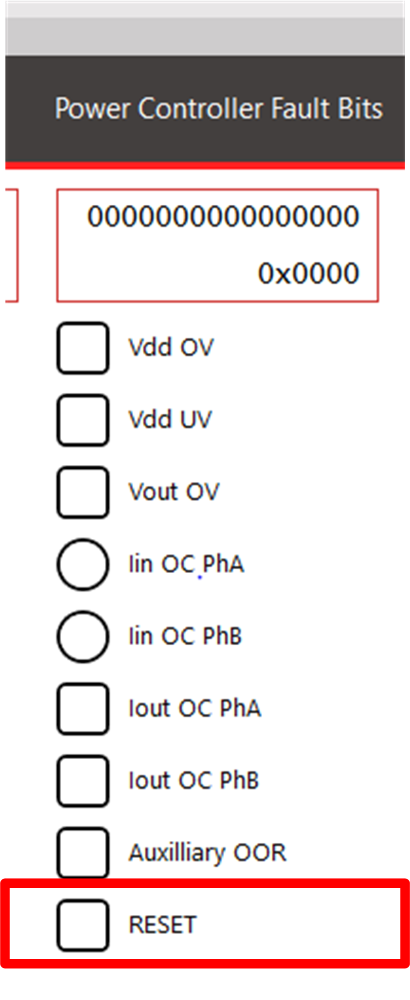
     
    ILLC faults with hardware protection.
  

[[back to top](#start-doc)]

- - -

# PWM Setup

Most of the PWM setup is done by calling initialization functions generated by MCC at the top of _main()_. Some more custom configuration is also done at runtime as required.

- - -

## PWM Routing

In this application, the DAB's primary bridge is drive by PWM1 (for P1 and P2) and PWM3 (for P3 and P4) while the secondary bridge where drive by PWM2 (for S1 and S2) and PWM4 (for S3 and S4).
Each PWMs run in complementary mode, with PWM2 and PWM4 with swapped output. 

PWMs are also configured in a cascaded way where the first PWM triggers the next PWM successively. This approach broadcasts a single PWM update, thus ensuring that the PWMs are updated in the same cycle. 
PWM1 is a master PWM while PWM2, PWM3, and PWM4 are the secondary PWMs that follows the PWM1. The PWM4 which is the last PWM in the cascaded sequence broadcast the Update bit to all PWMs. 

<a target="_blank" rel="nofollow">

&nbsp; 
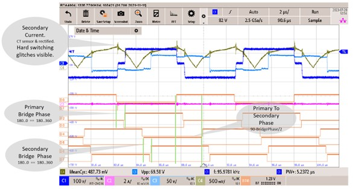

</a>

<a target="_blank" rel="nofollow">
Dual active Bridge simplified schematic and PWM signals
</a>

Theoretically, DAB is controlled by changing the phase of the bridges, often reffered as the <b>Control Phase</b>. In primary bridge, the phase shift between two half bridges is referred as <b>Primary Phase</b>, while in secondary bridge, the phase shift between two bridges is reffered as <b>Secondary Phase</b>.
The <b>Primary To Secondary Phase</b> is the phase shift between the primary bridge and secondary bridge.

The following equations for PWM phases where used to control the DAB converter. It is the PWM trigger that defines the control phase of the DAB converter.

		Primary Phase = Control Phase
		Secondary Phase = Control Phase
		Primary To Secondary Phase = 90 degrees - (Control Phase / 2)

  

    
     
    PWM configuration in MCC (easy setup).
  

[[back to top](#start-doc)]

- - -

## Compensator Settings

Since the plant frequency response is single pole system, it is sufficient to use voltage mode control to compensate for the plant, using a 2P2Z compensator.

As this is a frequency controlled converter, the control algorithm controls the PWM switching frequency to regulate the output voltage.

  

    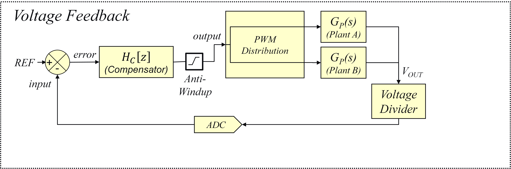
     
    Simplified block diagram of the control elements.
  

[Digital Compensator Design Tool](https://www.microchip.com/developmenttools/ProductDetails/DCDT), abbreviated to DCDT, was used to design the 2P2Z compensator.

To download and install DCDT, please follow the instructions at the link above.

To open DCDT from MPLABx, click "Tools -> Embedded -> Digital Compensator Design Tool".

On the pop-up window that appears, click "Open", which will open the "VMC" DCDT project associated with the LLC MPLABx project.

On the next window that appears (shown below) click on the compensator block.

  

    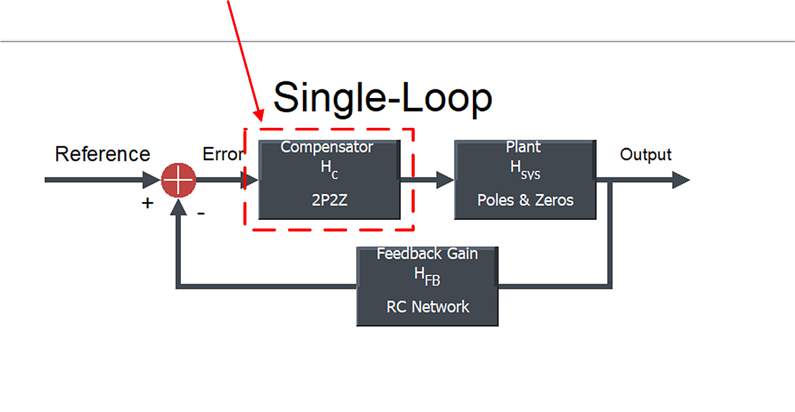
     
    Opening 2P2Z compensator in LLC DCDT project.
  

The compensator settings in DCDT are shown below.

  

    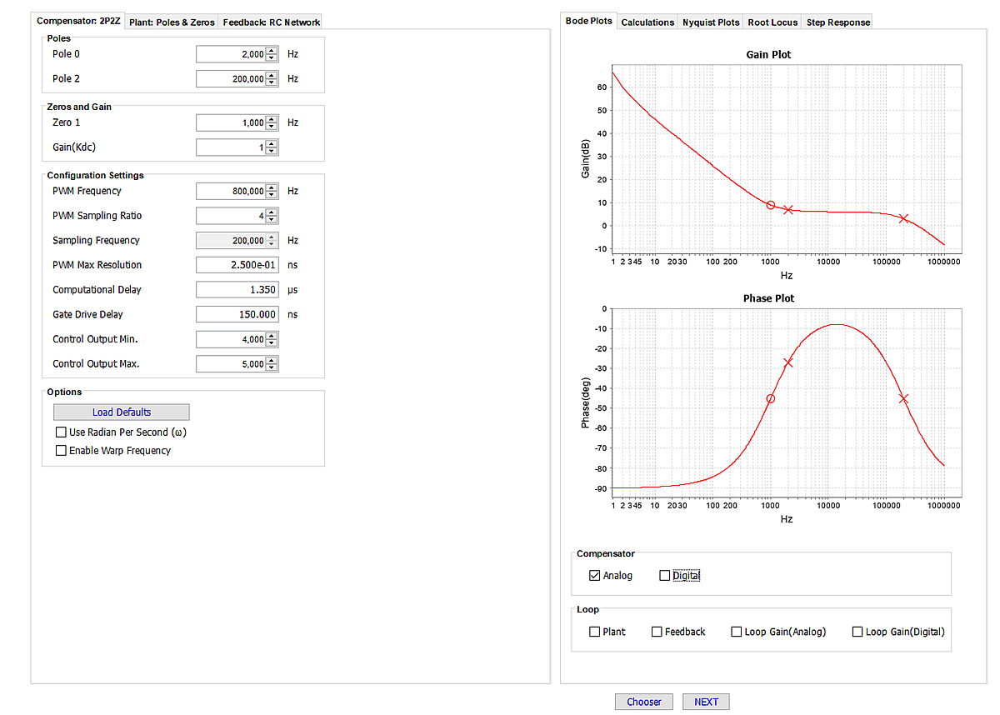
     
    Compensator settings in DCDT.
  

As can be seen above, for our 2P2Z compensator (which has 2 poles and 1 zero), we placed

- the pole at origin at 2kHz,
- the second pole at 200kHz,
- the zero at 1kHz.

Note that for this demo firmware, we tuned the compensator empirically.
For a 2P2Z compensator, typically the second pole is placed at high frequency (usually half of the ADC sampling frequency) to filter the effects of high frequency ripple and noise on the loop.
The zero is typically placed at a low frequency, perhaps somewhere between 200Hz and 500Hz to begin with. The purpose of this zero is to ensure that you have enough phase at the cross-over frequency.
The pole at origin is set to get as much DC gain as possible.

In this example, we started with a conservative coefficient set and moved the zero and pole at origin until our measured frequency response was deemed satisfactory.

[[back to top](#start-doc)]
- - -

### Open Loop Gain Measurements

In this section we shown the open loop gain and phase response. To clarify, these are the "open loop" measurements of the closed loop system - so the measurements include the plant, the voltage feedback network and the 2P2Z compensator.

For these measurements, the Bode 100 output was connected across the 20R resistor R120, using the test points TP120 and TP121. This resistor was placed between the output terminal of the converter and the resistor divider used for output voltage sensing by the dsPIC.

  

    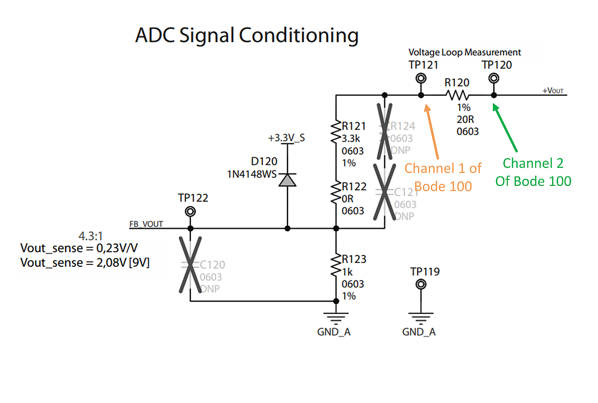
     
    Measuring the open loop gain on the LLC demo board.
  

Channel 2 of the Bode 100 was connected to TP120, and Channel 1 was connected to TP121.
See below for measurements taken across different load settings and input voltage settings.

Note that the crossover frequency, phase margin and slope of gain at the crossover frequency changes depending on the load and input voltage.
At 0.5A load, the SRs (and thus the current balancing scheme) are disabled, which slows down the loop response versus the measurements taken at 2.0A load.

  

    
     
    Open-loop gain/phase with Vin = 39V and Iload = 0.5A.
  

  

    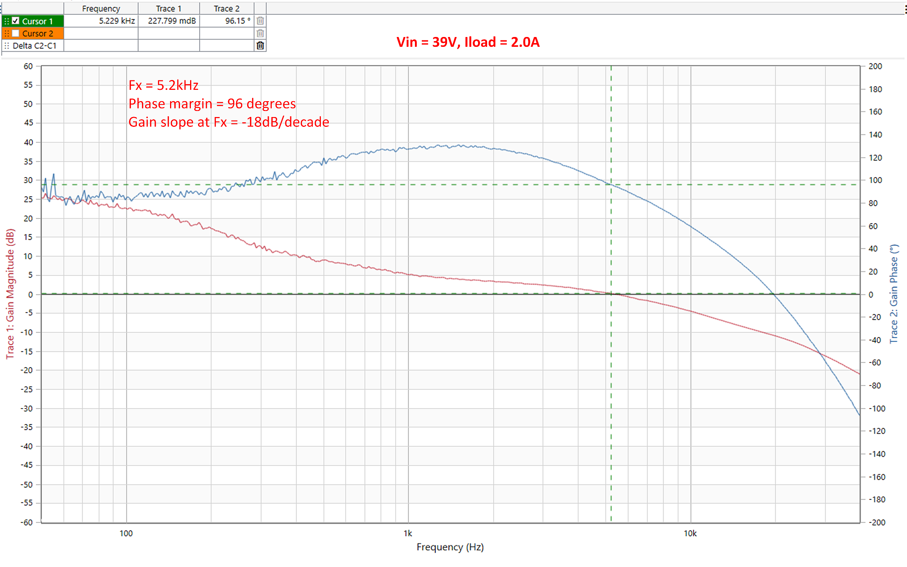
     
    Open-loop gain/phase with Vin = 39V and Iload = 2.0A.
  

  

    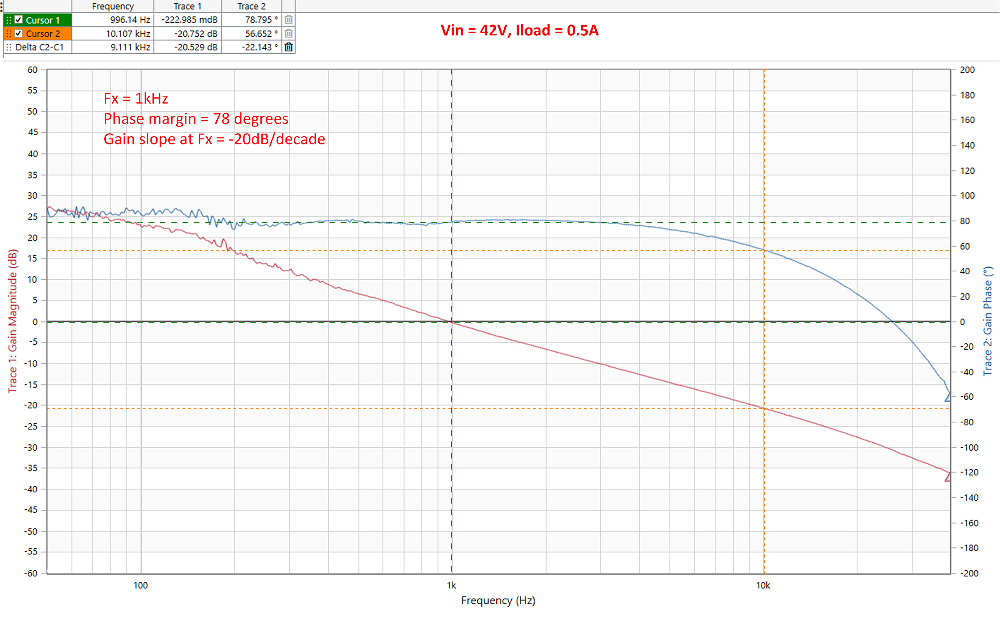
     
    Open-loop gain/phase with Vin = 42V and Iload = 0.5A.
  

  

    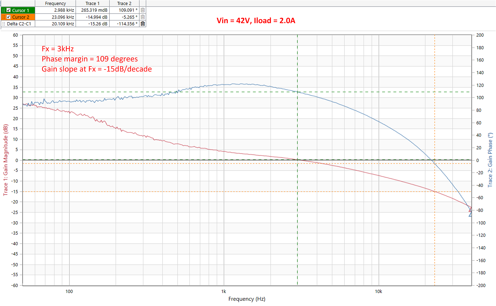
     
    Open-loop gain/phase with Vin = 42V and Iload = 2.0A.
  

[[back to top](#start-doc)]
- - -

# Phase Current Balancing

When two or more identical half-bridge LLC converters are interleaved, any differences in their tank circuits will lead to unequal sharing of the load current between individual phases. Unequal load sharing is a major problem in interleaving resonant converters as it decreases thermal stability and can lead to high-circulating currents and even converter failure.

A innovative current balancing scheme has been implemented on the demo firmware accompanying this board. The goal is that both phases share the load current equally. This scheme is only run if the total load current is above 1.4A (see the macro _IOUT_SRONIL_in the firmware).
The code is located in the function_Drv_PwrCtrl_ILLC_ILPHVoltageLoop()_, which is in the file _power_controller/drv_pwrctrl_ILLC_SRandControl.c_. This function is called from the ADCAN0 interrupt, which is located in the file _driver/drv_adc.c_.

  

    
     
    Block diagram of LLC control loop with current balancing.
  

The scheme works by changing the duty cycle of the SR drive signals on one phase until both phase currents are approximately the same, while keeping the duty cycle of the SR drives on the other phase fixed.

When the scheme is launched, the (filtered) currents of both phases are compared. The phase with the smaller current runs at a fixed (just under 50%) duty cycle, while the duty cycle of the SRs on the phase with the larger current is varied between a min value (100ns) and a max value (just under 50%) until the two currents are as close as possible.

Decreasing the duty cycle of the SR drives on one phase increases the dynamic resistance presented to the secondary current flowing through this phase. This results in less current flowing through the phase and more through the other phase. The total output current remains the same.

[[back to top](#start-doc)]
- - -

## SR Drive State Machine

  

    
     
    Current balancing state machine.
  

The state machine that runs the current balancing algorithm is illustrated above. It is run in the ADCAN0 interrupt, which is executed every 6th PWM period.

 
 

[[back to top](#start-doc)]
- - -

### STANDBY State

Both SRs are disabled, so any conduction is through the body diodes of the SRs. We stay in this state until the output voltage is above 6V (see macro _VOUT_SR_ACTIVE_) and the total output current is above 1.4A (see macro _IOUT_SRONIL_). If both of these conditions are satisfied we go to the enable state.

  

    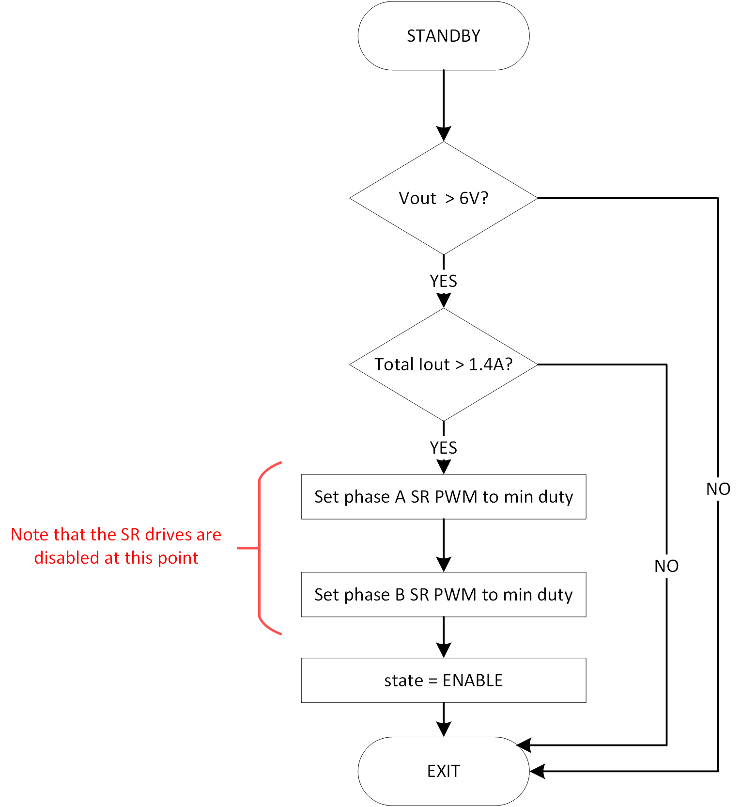
     
    Flowchart for STANDBY state.
  

[[back to top](#start-doc)]
- - -

 

### ENABLE State

Both SRs are still disabled. The two phase currents are compared. In our current balancing algorithm, the phase with the smaller current has a fixed SR duty cycle, and the SR duty of the other phase is varied to get the currents in balance. So the decision on which phase to fix and which to vary is made once at this point, and remains in force while the algorithm is active.

Note that the phase current measurements used for the comparison are filtered to reduce the effect of noise on the decision.

  

    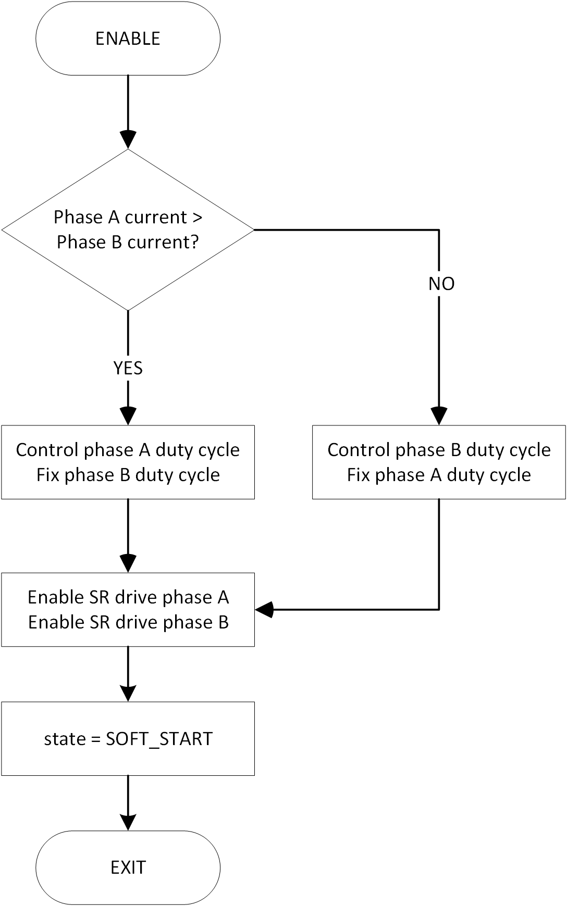
     
    Flowchart for ENABLE state.
  

After the comparison is made, PWM2 and PWM4 (the PWMs used to drive the SRs for phase A and phase B respectively) are enabled and set at min duty cycle. The PWM setup is actually done in the STANDBY state, but the PWM outputs from the dsPIC are not enabled until the ENABLE state.

  

    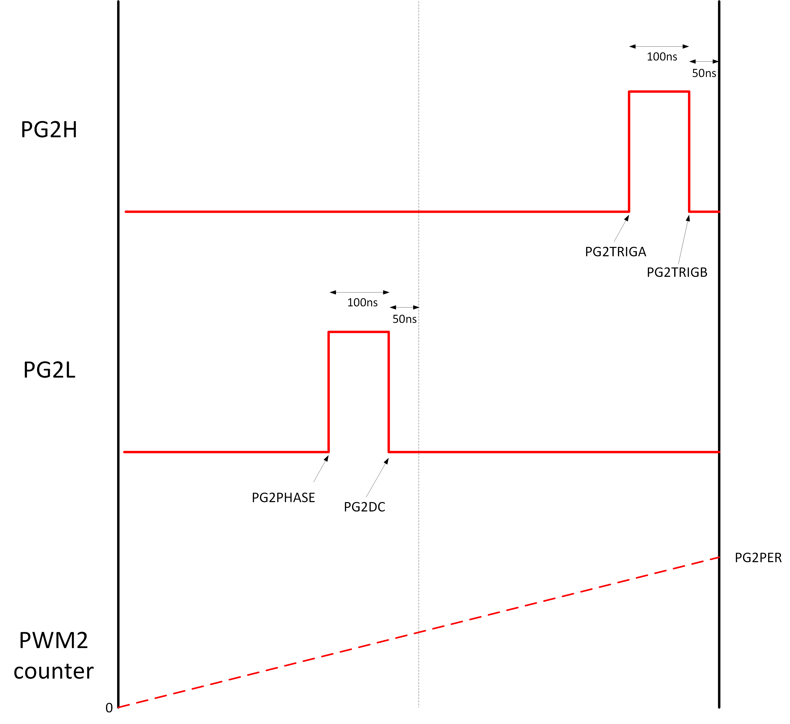
     
    PWM 2 setup.
  

As discussed previously, the PWMs are configured in "Independent, dual output" mode. To recap, PG2 is used to drive the SRs for phase A, and PG4 is used to drive the SRs for phase B.

For phase A, the rising edge of PWM2H is set via the PG2TRIGA register (so the event is triggered when the internal period counter in PG2 reaches PG2TRIGA), and the falling edge set via PG2TRIGB. The rising edge of PWM2L is set by the PG2PHASE register, and the falling edge via the PG2DC register.

For phase B SR drive, PG4 is used, so PG4TRIGA, PG4TRIGB, PG4PHASE and PG4DC are used to set the rising and falling edges on PG4H and PG4L in the same way as for PG2.  

[[back to top](#start-doc)]
- - -

 

### SOFTSTART State

In this state, the duty cycles of the SR drives on both PG2 and PG4 are linearly ramped from the min duty (100ns pulse width) to the max duty (PGxPER/2*250ps - 124ns) in steps of 10ns.

  

    
     
    PWM2 signal during soft-start.
  

The falling edges of the PWM2 and PWM4 outputs are fixed during the ramping of the duty cycle, and the rising edges are moved.
For PG2, PG2TRIGB is fixed at 50ns before the end of period, and PG2DC fixed at 50ns before the end of the half-period. For PG4, PG4TRIGB is fixed at 50ns before the end of period, and PG4DC fixed at 50ns before the half-period.  

During the soft-start ramp, PG2TRIGA, PG2PHASE, PG4TRIGA and PG4PHASE are decreased by steps equivalent to 10ns so that the duty cycle increases by 10ns each time.

The ramp is stopped when the rising edge of PG2PHASE is 74ns from the start of the period. Thus at the end of the ramp, all SR drive signals are running at just under 50% duty cycle (precisely, the on-time is [PG2PER/2*250ps] - 124ns).

At the end of the ramp, we change to the UP AND RUNNING state.

[[back to top](#start-doc)]
- - -

 

### UP AND RUNNING State

  

    
     
    Flowchart illustrating the UP AND RUNNING state.
  

In this state, one of the SR drives of either phase A or phase B runs at a fixed duty cycle, and the other is moved. The decision on which phase to fix and which to vary is made in the ENABLE state and doesn't change thereafter.

If the output current through the phase being controlled is greater than the current through the other (fixed duty) phase, we decrease the duty cycle of the SR drives by 2ns. If the current is smaller, we increase the duty cycle on the SR drives by 2ns. The on-time of the SR drives is clamped at a max value of [PGxPER/2*250ps - 124ns], and at a min value of 100ns.

If the total output current drops below 1.0A (see macro _IOUT_SROFFIL_), all SR drives are disabled, and we go back to the STANDBY state.

[[back to top](#start-doc)]
- - -

## Results

See results below. The two phase currents are out of balance until the total output current reaches 1.4A, at which point the current balancing algorithm kicks in, and the current is shared equally between the phases.

  

    
     
    Current Balancing.
  

Below we show how it works with a load step from 0 to 3A. The time-base is 200us/div, so you can see that the currents are in balance within 1.5ms.

  

    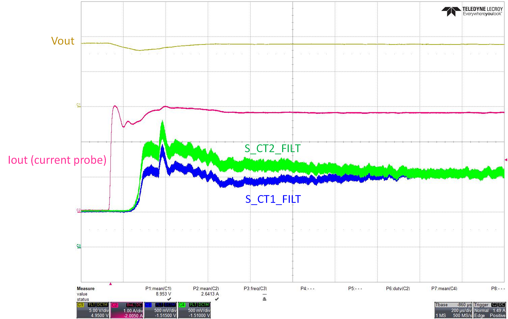
     
    Current Balancing with load step.
  

[[back to top](#start-doc)]

- - -

# Plant Frequency Response Simulation with MPLAB® Mindi™

Mindi™ is the Microchip-branded demo version of Simplis/SiMetrix. It supports the common features of the Simplis standard license but limits the number of circuit nodes.

We have included a model of the LLC converter in this deployment for educational purposes. See "mindi" folder.

  

    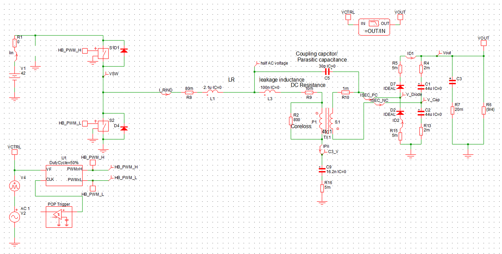
     
    Mindi Model of LLC converter.  
  

[[back to top](#start-doc)]

---

&copy; 2021, Microchip Technology Inc.
