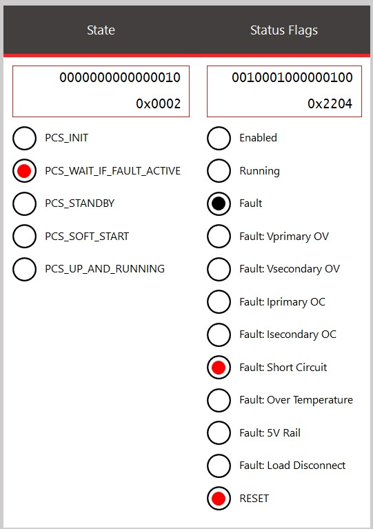
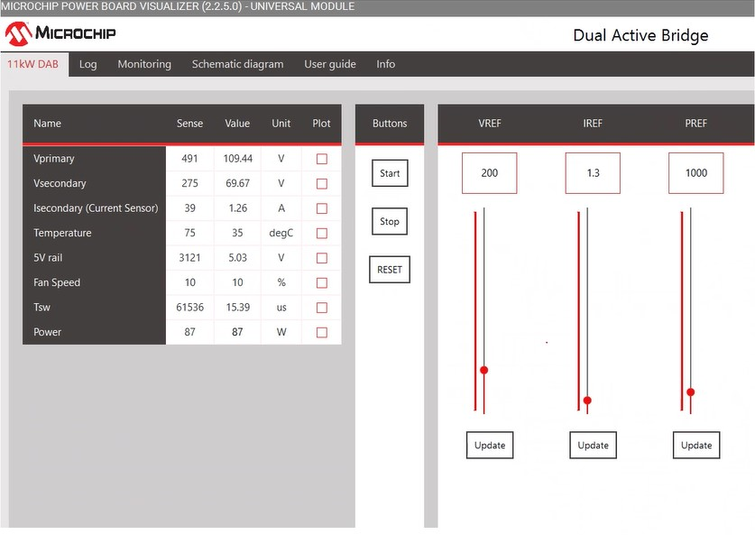
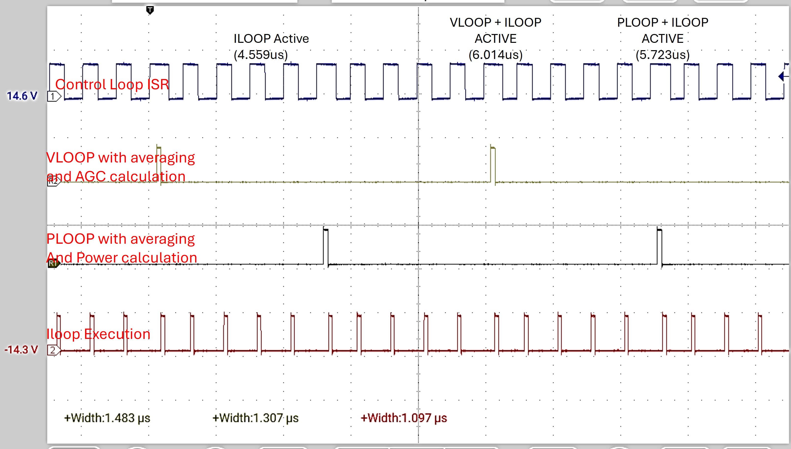

# Firmware Detail

The firmware overview indicates that the power controller state machine and fault handler are executed every 100 microseconds by the scheduler. Additionally, the GUI handler operates every 10 milliseconds, while the LED and fan operations, along with temperature checks, are performed every 100 milliseconds.

The system has a single interrupt source, the ControlLoop_Interrupt_CallBack(), which is executed every 10 microseconds. This callback measures voltages and currents on the DAB board using an ADC and feeds the data to three control loops. The Voltage and Power loops operate at 10 kHz, interleaved, while the Current Loop operates at 100 kHz.<p>
  <center>
    
    <br>
    Firmware overview.
  </center>
</p>

The Microchip Code Configurator (MCC) is utilized to set up peripherals. This configuration occurs at run-time at the beginning of the main() function, prior to the initiation of the background loop.

The project files are organized as follows:

- PBV Communication:
    - PBV_CAN.c: Manages CAN communication objects and functions.
    - PBV_UART.c: Manages UART communication objects and functions.
    - PBV_config.c: Configures functions for CAN and UART communication for the Power Board Visualizer (PBV).
    - PBV_dab_frame_map.c: User configuration for data transmission and reception with PBV.
    - PBV_interface.c: Contains generic communication functions for PBV.

- Device Management:
    - dev_current_sensor.c: Measures current sensor offset.
    - dev_fan.c: Initializes and controls fan speed.
    - dev_led.c: Provides LED functions to indicate the power converter's state.
    - dev_temp.c: Indicates and calculates the board temperature.

- Fault Handling:
    - fault.c: Manages fault initialization, execution, and handling.
    - fault_common.c: Contains generic fault handling functions.

- Power Control:
    - pwrctrl.c: Manages power control initialization, control loop, and execution.
    - pwrctrl_isr.c: Handles control loop interrupt callbacks, ADC data acquisition, and PWM distribution.
    - pwrctrl_pwm.c: Calculates DAB control phase and manages PWM distribution.
    - pwrctrl_sm.c: Executes the power control state machine every 100 microseconds.
    - pwrctrl_utils.c: Contains functions for power control ramp up/down and averaging.
    

<p>
  <center>
    
    <br>
    Firmware block diagram.
  </center>
</p>

The firmware block diagram illustrates the use of the dspic33C for a Dual Active Bridge converter. The following provides a detailed explanation of the firmware development for this application.

---

## Converter State Machine

The main power controller state machine, executed every 100 microseconds, is detailed in the function Dev_PwrCtrl_StateMachine(POWER_CONTROL_t* pcInstance) located in pwrctrl/pwrctrl_sm.c. The state machine progresses through a series of steps in a specific chronological order during its execution.

### Operating States
The state machine for the power control system (PCS) operates as follows:

- PCS_INIT_handler(): Resets conditional flag bits, disables PWM output, and runs initial current calibration offset. Then, it checks the fault handler.
- PCS_WAIT_IF_FAULT_ACTIVE_handler(): Checks for fault events. If none are detected, it transitions to the StandBy state.
- PCS_STANDBY_handler(): Waits for no fault events and the power control enable bit to be set. Once set, it resets fault status bits, PWM control settings, enables the power control running bit and PWM output, initializes control loop references, and moves to the soft start state.
- PCS_SOFT_START_handler(): Gradually adjusts power control references until the desired control reference is reached, then transitions to the online state.
- PCS_UP_AND_RUNNING_handler(): Enters constant regulation mode after successful startup, maintaining this mode until shutdown or suspension. It monitors and adjusts the control reference as needed using a defined transition ramp.

<p>
  <center>
    
    <br>
    Power supply state machine.
  </center>
</p>

<span id="soft-starting-the-converter"><a name="soft-starting-the-converter"> </a></span>

## Power Control Data Structure

Before utilizing the state machine, it is essential to define and initialize at least one Power control data object within the power control code. The following outlines the data structure of POWER_CONTROL_t and its usage.
```c
struct POWER_CONTROL_s
{
    STATUS_FLAGS_t          Status; ///< Power Supply status flags
    PWR_CTRL_STATE_t        State;  ///< Power Control State ID
    PWR_CTRL_PROPERTIES_t   Properties; ///< Power Control properties    
    SWITCH_NODE_t           Pwm;    ///< Switch node settings
    FEEDBACK_SETTINGS_t     Data;   ///< Feedback channel settings
    FAULT_SETTINGS_t        Fault;  ///< Fault flags and settings 
    START_UP_RAMP_t         VRamp;  ///< Voltage ramp-up settings
    START_UP_RAMP_t         IRamp;  ///< Current ramp-up settings
    START_UP_RAMP_t         PRamp;  ///< Power ramp-up settings
    CONTROLLER_t            ILoop;  ///< structure for current controller data
    CONTROLLER_t            VLoop;  ///< structure for voltage controller data
    CONTROLLER_t            PLoop;  ///< structure for power controller data
    PWR_CTRL_CHARGE_STATE_t    PowerDirection;  ///< defines if the power converter is in charging or discharging mode   
};
typedef struct POWER_CONTROL_s POWER_CONTROL_t;
```

##### Declaration Examples

```c
POWER_CONTROL_t dab;    // Declare DAB converter data structure
```

---

## Fault Protection

The fault protection code, executed every 10 microseconds within the interrupt service routine in the function Dev_Fault_Execute(), is located in the file fault/fault.c. There are two types of protection: firmware fault protection, implemented on the dsPIC on the DP-PIM, and hardware fault protection, implemented on the DAB power board. The primary purpose of these protections is to prevent catastrophic board damage, especially from input and output overcurrent events.

---

### Firmware Fault Protection

All our firmware fault protection systems operate with the same functionality, incorporating a trigger threshold, a clear threshold, a fault blanking time, and a fault clear time.

For instance, in the case of a fault with a "max" threshold (e.g., output over-voltage protection), the fault is triggered when the source exceeds the threshold. A timer starts once this threshold is breached. If the source remains above the threshold beyond the fault blanking time, the fault becomes active, causing the PWMs to switch off and the converter to enter the "FAULT ACTIVE" state. If the source drops below the threshold before the blanking time expires, the timer resets.

When the fault is active, it will be cleared if the source stays below the clear threshold for the fault clear time. Once all faults are cleared, the converter will either restart or be ready to start again.
<p>
  <center>
    
    <br>
    Firmware Fault protection.
  </center>
</p>

The accompanying flowchart illustrates the process in detail. If "fault active" is true, the fault is active, and the converter is disabled. Conversely, if "fault active" is false, the converter is permitted to attempt startup.
<p>
  <center>
    
    <br>
    Flowchart illustrating the firmware fault protection.
  </center>
</p>

The table below lists all faults that are protected by our firmware, which executes fault protection every 10 microseconds.
<p>
  <center>
    
    <br>
    DAB faults with firmware protection.
  </center>
</p>

---

### Hardware fault protection

The hardware fault protection system is engineered to avert significant board damage, particularly from input or output overcurrent. It activates instantaneously, setting all PWM drive signals to zero and shutting down the converter. This system functions independently of the dsPIC, ensuring that any drive signals from the dsPIC are overridden by the hardware protection before reaching the FET drivers.

When the hardware fault protection is triggered, it latches, meaning it will not reset automatically and requires manual intervention to clear.

To restart the board, follow these steps:

- Disable all PWMs by either holding down the RESET push button or erasing the dsPIC firmware (the latter is recommended for safety).
- Briefly press the "RESET protection" push button on the HMI interface.
Additionally, the dsPIC implements output overcurrent protection using comparators and DACs as follows:

The current transformer in the high voltage bridge sense is connected to CMP1DAC.
The current transformer in the low voltage bridge sense is connected to CMP3DAC.
These comparators has built-in digital filter that could blank the unwanted comparator output transitions due to analog comparator input signals that has been corrupted by the large electromagnetic fields generated by the external switching power transistors.

If either comparator trips, it triggers the highest priority interrupt, disabling all PWM drive signals and placing the converter in the "FAULT ACTIVE" state. Similar to the hardware fault protection, this fault protection is also latched, necessitating a dsPIC reset to restart the converter. If this fault protection is activated, the RESET flag in the Power Board Visualizer GUI will be set, indicating that the dsPIC needs to be reset to restart the DAB converter.

<p>
  <center>
    </p>
    DAB faults with hardware protection.
  </center>
</p>


---

## PWM Setup

The PWM setup for the DAB application is primarily configured using MCC-generated initialization functions in the main function, with additional custom configurations applied as needed. The application employs a dual phase shift (DPS) modulation scheme, which adjusts the phases in both primary and secondary bridges. This approach offers advantages over traditional phase shift (TPS) control by reducing current stress and enhancing system efficiency.
 
<p>
  <center>
    </p>
    DAB Dual phase shift control
  </center>
</p>

- - -

### PWM Routing

In this application, the primary bridge of the DAB is driven by PWM1 (for P1 and P2) and PWM3 (for P3 and P4), while the secondary bridge is driven by PWM2 (for S1 and S2) and PWM4 (for S3 and S4). Each PWM operates in complementary mode, with PWM3 and PWM4 having swapped outputs.
The output swapping of the PWM is an additional PWM settings that can be found in driver/mcc_extension/drv_custom_config_pwm.h.
<p>
  <center>
</p>
    Simplified DAB schematic
  </center>
</p>

<p>
  <center>
</p>
    Cascaded PWM modules 
  </center>
</p>

In a cascaded PWM configuration, the first PWM triggers subsequent PWMs in sequence, ensuring synchronized updates across all PWMs within the same cycle. In the DAB application, PWM1 acts as the master, while PWM2, PWM3, and PWM4 are secondary PWMs that follow PWM1. The configuration ensures that the start of each PWM cycle is dependent on the preceding PWM (e.g., PWM2 starts after PWM1, PWM3 after PWM2, and PWM4 after PWM3). PWM4, being the last in the sequence, broadcasts the update signal to all PWMs, ensuring synchronized data updates.

<p>
  <center>
    
    <br>
    PWM configuration in MCC Melody.
  </center>
</p>

---
## Power Control Compensator
In this project, the Microchip [Digital Compensator Design Tool](https://www.microchip.com/en-us/development-tool/dcdt) has been employed for managing control loops. This software utility is specifically designed to aid engineers in the development and optimization of digital compensators for power supply systems. The tool streamlines the design process of digital control loops by offering an intuitive interface for configuring and tuning compensators. 

This tool generates control loop files that are essential for code development. These files can be found in the directory pwrctrl/dcdt/. In the file pwrctrl_dcdt.c, users need to initialize the A- and B- coefficients of the control loop from DCDT, as well as set the scaling and limits for the control loop output. The control loop compensator is executed within the control loop interrupt service routine. This application includes three compensators: Voltage Loop, Current Loop, and Power Loop. The compensators are configured to allow users to adjust their limits in the Power Board Visualizer. The compensator with the lowest reference threshold will take precedence in controlling the loop.

<p>
  <center>
    </p>
    DAB Power Board Visualizer Control Loop 
  </center>
</p>

In this application, the Voltage loop and Power Loop is executed every 10KHz, with phase shift of 180 degrees making it interleaved with each other, while the Current Loop is executed every 100KHz. This timing diagram shows how much the control loop interrupt service routine in the CPU load.

<p>
  <center>
    </p>
    DAB Vloop, Ploop and ILoop Timing
  </center>
</p>

<p>
  <center>
    </p>
    DAB ISR Timing
  </center>
</p>

---

&copy; 2024, Microchip Technology Inc.

---

