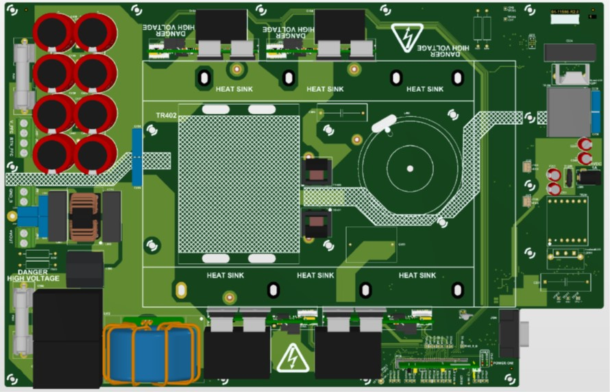

 

--- 
# Dual Active Bridge Development Board

<a target="_blank" rel="nofollow">

</a>

<a target="_blank" rel="nofollow">
dsPIC33C DAB Development Board
</a>

---

## Summary

This solution showcases the implementation of a Dual Active Bridge (DAB) application demonstration utilizing Microchip's dsPIC33C device, primarily aimed at automotive On-Board Charger applications. The DC-DC Dual Active Bridge Development Platform is a versatile development board featuring well-organized components, including an input filter, power stage, auxiliary supply, and a socket compatible with Microchip's latest Digital Power Plug-In Modules (DP PIMs).

The platform is designed to handle voltage levels of up to 700 VDC on the primary side and up to 400 VDC on the secondary side. Additionally, it includes a socket for dsPIC33 plug-in modules, enabling the system to be tested with various controllers. The pinout is compatible with EP, CK, and CH dsPIC DSC DP PIMs, ensuring flexibility and ease of use.

---

## Highlights
 - Digitally-Controlled Dual Active Bridge Converter
 - Utilization of dsPIC peripherals that allows switching frequency operation ranging from 65KHz to 300KHz
 - dspic33 plug-in module mating socket pinout compatible to other DSC DP PIMs.

---

## Related Documentation

__Firmware documentation__

- [Online Firmware Documentation of this Code Example](https://microchip-pic-avr-examples.github.io/dspic33ck-power-dcdc-dual-active-bridge-development-platform/)

__Hardware Documentation__

- Will be available soon

__Target Device Documentation__

- [dsPIC33CK256MP508 Family Data Sheet](https://www.microchip.com/70005349)
- [dsPIC33CK256MP508 Family Silicon Errata and Data Sheet Clarification](https://www.microchip.com/80000796)

__Please always check for the latest data sheets on the respective product websites:__

- [dsPIC33CK256MP508 Family](https://www.microchip.com/dsPIC33CK256MP508)
- [dsPIC33CH512MP508 Family](https://www.microchip.com/dsPIC33CH512MP508)

---

## Software Used

- [Power Board Visualizer GUI](https://www.microchip.com/en-us/software-library/power_board_visualizer)
- [MPLAB&reg; X IDE v6.20](https://www.microchip.com/en-us/tools-resources/develop/mplab-x-ide)
- [MPLAB&reg; XC-DSC Compiler v3.10](https://www.microchip.com/en-us/tools-resources/develop/mplab-xc-compilers/xc-dsc)
- [Microchip Code Configurator v5.5.1](https://www.microchip.com/mplab/mplab-code-configurator)
- [Digital Compensator Design Tool](https://www.microchip.com/developmenttools/ProductDetails/DCDT)

---

## Hardware Used

- Will be available soon

---

&copy; 2024, Microchip Technology Inc.

