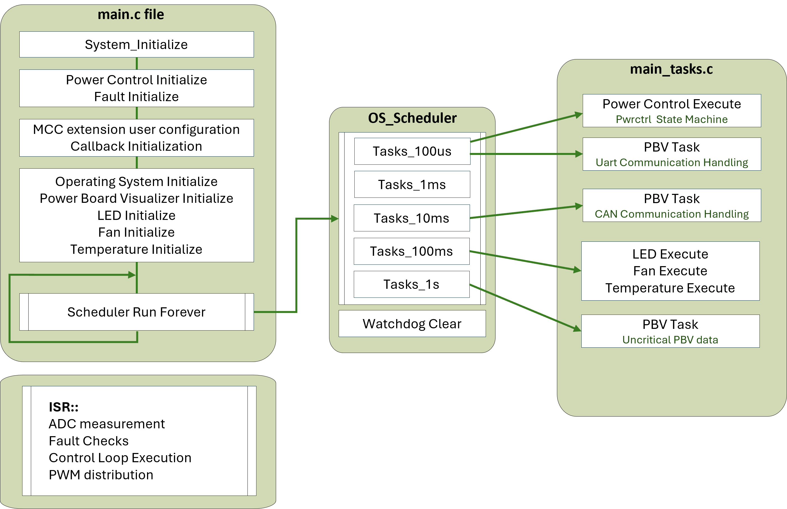
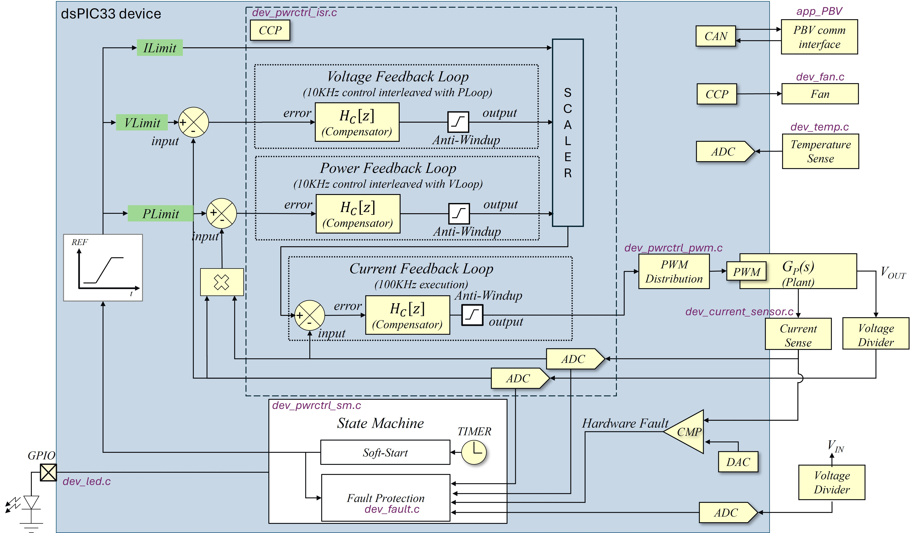
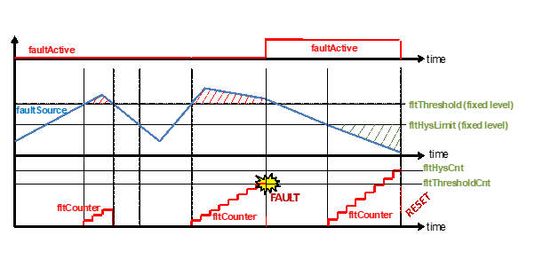
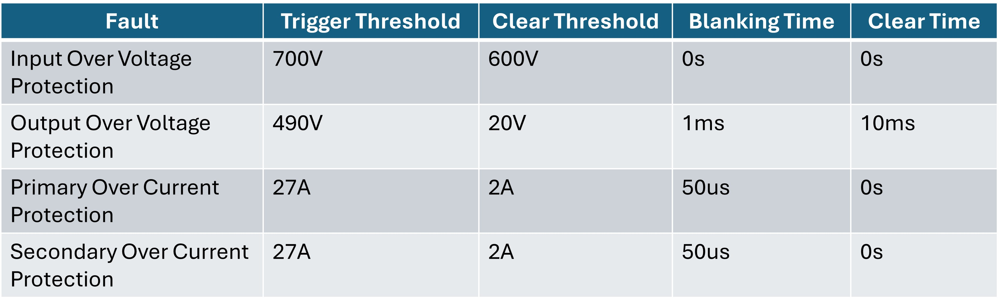
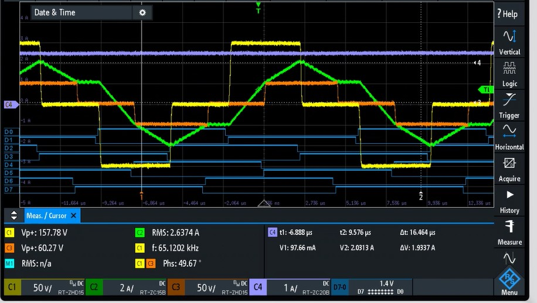

 

--- 
# dsPIC33CK Power DC-DC Dual Active Bridge Development Platform

<a target="_blank" rel="nofollow">

&nbsp; 

</a>

<a target="_blank" rel="nofollow">
dsPIC33C DAB Development Board
</a>

---

## Summary

This solution demonstrates the implementation of a Dual Active Bridge (DAB) Application Demonstration based on Microchip's dsPIC33C device with its primary target application as an automotive On-Board Charger.

The DC-DC Dual Active Bridge Development Platform is a generic development board with well organized building blocks that include an input filter, power stage, auxiliary supply, mating socket for Microchip's newest Digital Power Plug-In Modules (DP PIMs), Human Machine Interface (HMI) and test points. 
The electrical characteristics are prepared to allow safe voltage levels of up to 700 VDC primary voltage and up to 400 VDC secondary voltage. 
A mating socket for dsPIC33 plug-in modules allows the system to be evaluated with different controllers. The pinout is compatible for EP, CK and CH dsPIC® DSC DP PIMs. A Human-Machine-Interface (HMI) and test points allow for easy evaluation and debugging. 

[[back to top](#start-doc)]

---

## Highlights
 - Digitally-Controlled Dual Active Bridge Converter
 - Utilization of dsPIC peripherals that allows switching frequency operation ranging from 65KHz to 300KHz
 - dspic33 plug-in module mating socket pinout compatible to other DSC DP PIMs.

 [[back to top](#start-doc)]

---

## Related Documentation

__Firmware documentation__

- [Online Firmware Documentation of this Code Example]()

__Hardware Documentation__

- ADD HERE HARDWARE DOCUMENTATION

__Target Device Documentation__

- [dsPIC33CK256MP508 Family Data Sheet](https://www.microchip.com/70005349)
- [dsPIC33CK256MP508 Family Silicon Errata and Data Sheet Clarification](https://www.microchip.com/80000796)

__Please always check for the latest data sheets on the respective product websites:__

- [dsPIC33CK256MP508 Family](https://www.microchip.com/dsPIC33CK256MP508)
- [dsPIC33CH512MP508 Family](https://www.microchip.com/dsPIC33CH512MP508)
 
 [[back to top](#start-doc)]

---

## Software Used

- [Power Board Visualizer GUI](https://www.microchip.com/en-us/software-library/power_board_visualizer)
- [MPLAB&reg; X IDE v6.20](https://www.microchip.com/mplabx-ide-windows-installer)
- [MPLAB&reg; XC-DSC Compiler v3.10](https://www.microchip.com/mplabxc16windows)
- [Microchip Code Configurator v5.5.1](https://www.microchip.com/mplab/mplab-code-configurator)
- [Digital Compensator Design Tool](https://www.microchip.com/developmenttools/ProductDetails/DCDT)

[[back to top](#start-doc)]

---

## Hardware Used

- [dsPIC33C DAB Development Board]()

[[back to top](#start-doc)]

---

## Firmware Overview

An overview of the firmware is shown below.
The power controller state machine and fault handler are executed every 100us by the scheduler. So also are the GUI handler (every 10ms), and the LED and Fan execution and temperature checking (every 100ms).

There is one interrupt source.

- <b>ControlLoop_Interrupt_CallBack</b>: executed every 10us. Voltages and currents in teh DAB board is being measured by ADC and feed to the control loops. There are three control loops in this implementation where Voltage loop and Power loop are executed every 10KHz, interleaved, while Current Loop is executed every 100KHz.

  

    
     
    Firmware overview.
  

Microchip Code Configurator (MCC) is used to configure the peripherals. They are configured at run-time at the start of _main()_ function, before the background loop is initiated.

The task files are as follows:
- _app/app_PBV_CAN.c_ : Contains the objects and functions for CAN communication.
- _app/app_PBV_config.c_ : Configures the list of functions that needs to be executed when Power Board Visualizer (PBV) use CAN communication or Uart communication.
- _app/app_PBV_dab_frame_map.c_ : User configuration for data that will be transmitted and received to/from Power Board Visualizer.
- _app/app_PBV_interface.c_ : Contains generic communicationfunctions for Power board Visualizer.
- _app/app_PBV_UART.c_ :  Contains the objects and functions for CAN communication.
- _device/dev_current_sensor.c_ : Contains function that measures the current sensor offset.
- _device/dev_fan.c_ : Contains functions that initialize and changes the speed of the fan.
- _device/dev_led.c_ : Contains LED functions that gives the user an indication of the current state of the power converter. 
- _device/dev_temp.c_ : Contains the temperature indication and calculation for the actual board temperature.
- _fault/dev_fault.c_ : Contains the fault initialization, execution and fault handling. 
- _fault/dev_fault_common.c_ : Contains generic fault functions for handling fault events.
- _pwrctrl/dev_pwrctrl.c_ : Contains power control initialization including control loop initialization and start-up initialization, and the power control execution. 
- _pwrctrl/dev_pwrctrl_isr.c_ : Contains Control loop interrupt Callback that acquires the ADC raw data and process it in the control loop, and use the control output for the PWM distribution for this converter
- _pwrctrl/dev_pwrctrl_pwm.c_ : Contains DAB control phase calculation between primary and secondary, and the PWM distribution.
- _pwrctrl/dev_pwrctrl_sm.c_ : Contains power control state machine that is executed every 100us.
- _pwrctrl/dev_pwrctrl_utils.c_ : Contains generic functions that handles power control ramp Up/Down and, the averaging generic fucntion.

  

    
     
    Firmware block diagram.
  

This firmware block diagram depicts how the dspic33C was used for Dual Active bridge converter. Below is the detailed information how the firmware was built for this application.

[[back to top](#start-doc)]

- - -

## Converter State Machine

The main power controller state machine is illustrated below. It is executed every 100us. 
The code is located in _pwrctrl/dev_pwrctrl_sm.c_, see the function Dev_PwrCtrl_StateMachine(POWER_CONTROL_t* pcInstance). 
During execution, the state machine goes through the following steps in chronological order.

### Operating States
- _PCS_INIT_handler()_ : This state resets the conditional flag bits, ensures PWM output is disabled and run the initial current calibration offset. After this, the 
state machine moves to checking the fault handler.
- _PCS_WAIT_IF_FAULT_ACTIVE_handler()_ : This state checks if there is fault event that occurred. When  there is no fault event, the state machine moves to StandBy state. 
- _PCS_STANDBY_handler()_ : This state waits until there is no fault event that has occurred and when the power control enable bit is set. When Enable bit is set, then this state reset the fault objects status bits, reset PWM control settings, enable the power control running bit, enable PWM physical output, initialize control loop references and then move to the soft start state.
- _PCS_SOFT_START_handler()_ : This state gradually ramps up/down the references of the power control. The control loop references are gradually incremented/decremented until in reached the desired control reference. When this is achieved, the next state will be assigned to state online. 
- _PCS_UP_AND_RUNNING_handler()_ : Once the start procedure has been completed successfully, the converter state machine drops into constant regulation mode, where it will remain until the converter is shut-down or suspended. During constant regulation the control reference is monitored. If the value of the control reference is changed, the state machine will tune into the new reference by generating a defined transition ramp using the ramp slope specified in the startup ramp timing.

  

    
     
    Power supply state machine.
  

## Power Control Data Structure

ToDo: add content here

[[back to top](#start-doc)]

- - -

## Fault Protection

The fault protection code is executed every 10us in theinterrupt service routine in the function _Dev_Fault_Execute()_. The body of the fault code is located in the files _device/fault/dev_fault.c_.

There are two types of protection:

1. Firmware fault protection
2. Hardware fault protection

The firmware fault protection is implemented on the dsPIC on the DP-PIM. The hardware fault protection is implemented on the DAB power board. It's purpose is to prevent catastrophic board damage, particularly due to input and output over current events.

[[back to top](#start-doc)]
- - -

### Firmware Fault Protection

All of our firmware fault protection has the same functionality. Each fault has a trigger threshold, a clear threshold, a fault blanking time and a fault clear time.

This is illustrated below, for a fault with a "max" threshold, which means that the fault is triggered when the fault source is above a threshold (output over voltage protection, for example).

Once the fault source breaches the trigger threshold, a timer is started. If the fault source stays above the trigger threshold for longer than the fault blanking time, then the fault becomes active, which means that the PWMs are switched off and the converter state machine is set to the "FAULT ACTIVE" state.

If the fault source drops back below the trigger threshold before the fault blanking time has expired, the timer is reset.  

When the fault is active, if the fault source stays below the fault clear threshold for the duration of the fault clear time, then the fault is cleared. When all fault sources are cleared, the converter will attempt to restart.

  

    
     
    Firmware Fault protection.
  

This is shown in more detail in a flowchart below. When "fault active == true", then the fault is active and the converter is disabled. When "fault active == false" the converter can attempt to start up.

  

    
     
    Flowchart illustrating the firmware fault protection.
  

All faults shown in the table below have firmware protection like this. In our firmware, this fault protection is run every 10us.

  

    
     
    DAB faults with firmware protection.
  

[[back to top](#start-doc)]
- - -

### Hardware fault protection

The purpose of the hardware fault protection is to prevent catastrophic board damage, particularly from input or output over current.
Once triggered, it kicks in immediately (there is no fault blanking time). It sets all PWM drive signals to 0, which will turn off the converter. Note that this is completely independent of the dsPIC, so even if there are drive signals coming from the dsPIC when the hardware fault protection is tripped, the hardware protection will over-ride these signals (through AND gates on the hardware) before they get to the FET drivers.

  

    
     
    DAB faults with hardware protection.
  

If the hardware fault protection is triggered, the red LED will turn on. The protection is latched, meaning that once triggered it will not clear itself, it needs to be manually cleared.

If you want to re-run the board, you need to

- disable all PWMs first, either by holding down the RESET push button, or erasing the dsPIC firmware (we recommend the second option as it is safer)
- then short press the "RESET protection" push button on the HMI interface.

On the dsPIC, output over current protection using comparators and DACs is also implemented as follows:

- Current transformer in high voltage Bridge sense tied to CMP1DAC 
- Current transformer in low voltage Bridge sense tied to CMP3DAC 

Either of these comparators tripping will trigger the highest priority interrupt, which disables all PWM drive signals and puts the converter in the "FAULT ACTIVE" state.
Like the hardware fault protection, this fault protection is also latched, meaning that the dsPIC needs to be reset to restart the converter. If this fault protection is triggered, the RESET flag in the Power Board Visualizer GUI will be set, as shown below, indicating that the dsPIC needs to be reset to re-start the LLC converter.

  

    
     
    DAB faults with hardware protection.
  

[[back to top](#start-doc)]

- - -

## PWM Setup

Most of the PWM setup is done by calling initialization functions generated by MCC at the top of _main()_. Some more custom configuration is also done at runtime as required.

- - -

### PWM Routing

In this application, the DAB's primary bridge is drive by PWM1 (for P1 and P2) and PWM3 (for P3 and P4) while the secondary bridge where drive by PWM2 (for S1 and S2) and PWM4 (for S3 and S4).
Each PWMs run in complementary mode, with PWM2 and PWM4 with swapped output. 

  

    Simplified DAB schematic
  

  

    
    PWM signal
  

PWMs are also configured in a cascaded way where the first PWM triggers the next PWM successively. This approach broadcasts a single PWM update to all PWMs, thus ensuring that the PWMs are updated in the same cycle. 
In the DAB application, PWM1 is a master PWM while PWM2, PWM3, and PWM4 are the secondary PWMs that follows PWM1. 
The figure below depicts the PWM configuration when the Start of Cycle of PWM2/3/4 are dependent to the PWM prior to its instance (PWM2 start of cycle is PWM1, PWM3 start of cycle is PWM2, and PWM4 start of cycle is PWM3). 
The PWM4 which is the last PWM in the cascaded sequence broadcast the Update bit to all PWMs (PWM1/2/3 data update is dependent on the Update bit of PWM4). 

  

    
     
    PWM configuration in MCC Melody.
  

[[back to top](#start-doc)]

## ADC Setup
add content here

- - -

[[back to top](#start-doc)]

- - -

## Compensator Settings

mention DCDT configuration
relevant files for dcdt

[[back to top](#start-doc)]

&copy; 2024, Microchip Technology Inc.

---

### Footnotes

