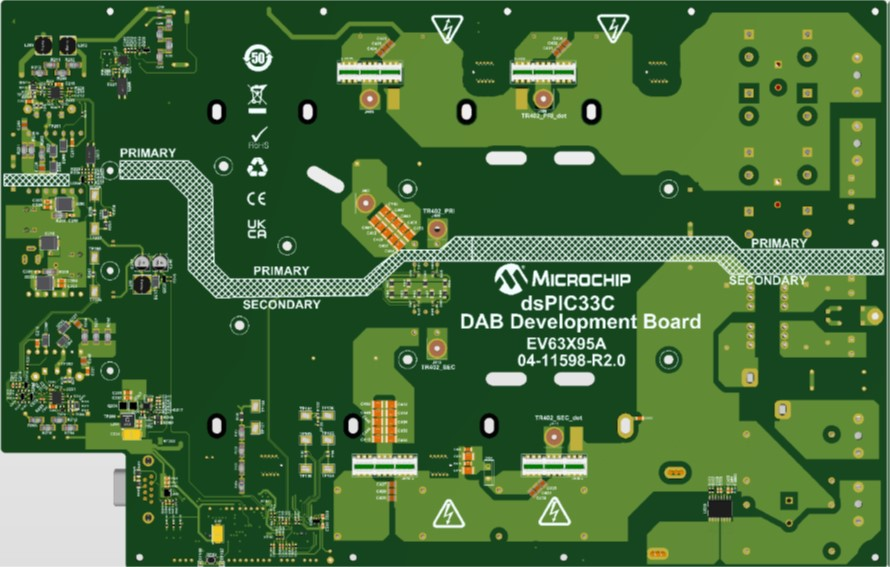

 

--- 
# dsPIC33CK Power DC-DC Dual Active Bridge Development Platform

<a target="_blank" rel="nofollow">

&nbsp; 

</a>

<a target="_blank" rel="nofollow">
dsPIC33C DAB Development Board
</a>

---

## Summary

This solution demonstrates the implementation of a Dual Active Bridge (DAB) Application Demonstration based on Microchip's dsPIC33C device with its primary target application as an automotive On-Board Charger.

The DC-DC Dual Active Bridge Development Platform is a generic development board with well organized building blocks that include an input filter, power stage, auxiliary supply, mating socket for Microchip's newest Digital Power Plug-In Modules (DP PIMs), Human Machine Interface (HMI) and test points. 
The electrical characteristics are prepared to allow safe voltage levels of up to <b>__ VDC</b> in and up to <b>__ VDC</b> out. 
A mating socket for dsPIC33 plug-in modules allows the system to be evaluated with different controllers. The pinout is compatible for EP, CK and CH dsPIC® DSC DP PIMs. A Human-Machine-Interface (HMI) and test points allow for easy evaluation and debugging. 

[[back to top](#start-doc)]

---

## Highlights
 - 

 [[back to top](#start-doc)]

---

## Related Documentation

__Firmware documentation__

- [Online Firmware Documentation of this Code Example]()

__Hardware Documentation__

__Target Device Documentation__

- [dsPIC33CK256MP508 Family Data Sheet](https://www.microchip.com/70005349)
- [dsPIC33CK256MP508 Family Silicon Errata and Data Sheet Clarification](https://www.microchip.com/80000796)

__Please always check for the latest data sheets on the respective product websites:__

- [dsPIC33CK256MP508 Family](https://www.microchip.com/dsPIC33CK256MP508)
- [dsPIC33CH512MP508 Family](https://www.microchip.com/dsPIC33CH512MP508)
 
 [[back to top](#start-doc)]

---

## Software Used

- [Power Board Visualizer GUI](https://www.microchip.com/en-us/software-library/power_board_visualizer)
- [MPLAB&reg; X IDE v5.50](https://www.microchip.com/mplabx-ide-windows-installer)
- [MPLAB&reg; XC16 Compiler v1.70](https://www.microchip.com/mplabxc16windows)
- [Microchip Code Configurator v5.0.3](https://www.microchip.com/mplab/mplab-code-configurator)
- [Digital Compensator Design Tool](https://www.microchip.com/developmenttools/ProductDetails/DCDT)
- [MPLAB&reg; Mindi™ Simulator](https://www.microchip.com/en-us/development-tools-tools-and-software/embedded-software-center/mplab-mindi-analog-simulator)

[[back to top](#start-doc)]

---

## Hardware Used

- [dsPIC33C DAB Development Board]()

[[back to top](#start-doc)]

---

## Security and Safety Requirements

Unattended operating power supplies are always a potential safety risk as short circuits or failures of power components can occur at any time where even seemingly small power converters can cause fire or damage connected equipment.

- This development board has not been FCC approved nor certified and must not be used outside a laboratory environment
- Never operate the board unattended
- Only use power supplies delivered with the board or equal, approved laboratory equipment
- Read the user guide for detailed operating instructions to prevent damage to the board or connected equipment

---

## Setup

Ask Lorant for the test Set-up

<a target="_blank" rel="nofollow">

</a>

<a target="_blank" rel="nofollow">
Dual active Bridge Converter System Overview
</a>

## Operation

<a target="_blank" rel="nofollow">

</a>

<a target="_blank" rel="nofollow">
Power Board Visualizer 
</a>

After the device has been programmed and the target device starts up, the Power Board Visualizer will display the runtime data, showing the most recent input and output voltages, output current, temperature, 5V rail voltage, Fan speed, Switching period, power, the state being executed in the state machine along with the status flags. There are also parameters in the power board visualizer that the user can control like the voltage reference, current reference and power reference.   

### PWM Set-Up

In this application, the DAB's primary bridge is drive by PWM1 (for P1 and P2) and PWM3 (for P3 and P4) while the secondary bridge where drive by PWM2 (for S1 and S2) and PWM4 (for S3 and S4).
Each PWMs run in complementary mode, with PWM2 and PWM4 with swapped output. 

PWMs are also configured in a cascaded way where the first PWM triggers the next PWM successively. This approach broadcasts a single PWM update, thus ensuring that the PWMs are updated in the same cycle. 
PWM1 is a master PWM while PWM2, PWM3, and PWM4 are the secondary PWMs that follows the PWM1. The PWM4 which is the last PWM in the cascaded sequence broadcast the Update bit to all PWMs. 

<a target="_blank" rel="nofollow">

&nbsp; 

</a>

<a target="_blank" rel="nofollow">
Dual active Bridge simplified schematic and PWM signals
</a>

Theoretically, DAB is controlled by changing the phase of the bridges, often reffered as the <b>Control Phase</b>. In primary bridge, the phase shift between two half bridges is referred as <b>Primary Phase</b>, while in secondary bridge, the phase shift between two bridges is reffered as <b>Secondary Phase</b>.
The <b>Primary To Secondary Phase</b> is the phase shift between the primary bridge and secondary bridge.

The following equations for PWM phases where used to control the DAB converter. It is the PWM trigger that defines the control phase of the DAB converter.

		Primary Phase = Control Phase
		Secondary Phase = Control Phase
		Primary To Secondary Phase = 90 degrees - (Control Phase / 2)

### Start-Up Sequence
<i>add content here</i>

### Control Loop 

<a target="_blank" rel="nofollow">

</a>

<a target="_blank" rel="nofollow">
Dual Active Bridge Control Loop
</a>

This figure depicts the block diagram of the DAB converter 

---

&copy; 2024, Microchip Technology Inc.

---

### Footnotes

