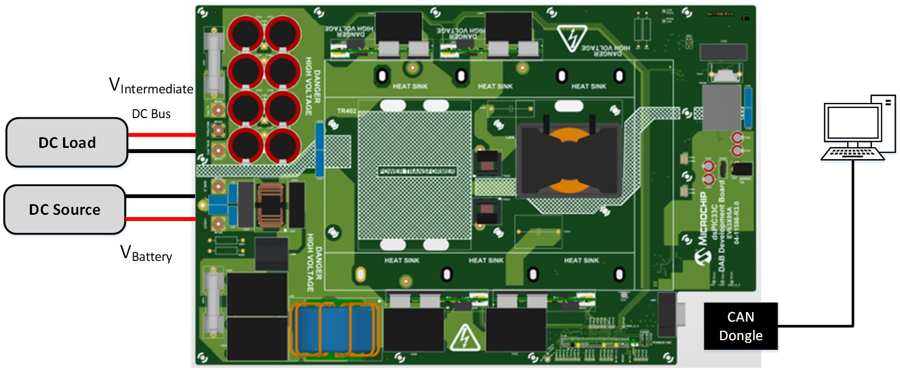

 

--- 
# Dual Active Bridge Development Board

<a target="_blank" rel="nofollow">

</a>

<a target="_blank" rel="nofollow">
dsPIC33C DAB Development Board
</a>

---

## Summary

This solution showcases the implementation of a Dual Active Bridge (DAB) application demonstration utilizing Microchip's dsPIC33C device, primarily aimed at automotive On-Board Charger applications. The DC-DC Dual Active Bridge Development Platform is a versatile development board featuring well-organized components, including an input filter, power stage, auxiliary supply, and a socket compatible with Microchip's latest Digital Power Plug-In Modules (DP PIMs).

The platform is designed to handle voltage levels of up to 800 VDC on the primary side and up to 900 VDC on the secondary side. Additionally, it includes a socket for dsPIC33 plug-in modules, enabling the system to be tested with various controllers. The pinout is compatible with EP, CK, and CH dsPIC DSC DP PIMs, ensuring flexibility and ease of use.

---

## Highlights
 - Digitally-Controlled Dual Active Bridge Converter
 - Utilization of dsPIC peripherals that allows switching frequency operation ranging from 65KHz to 300KHz
 - dspic33 plug-in module mating socket pinout compatible to other DSC DP PIMs.
 - Can be operated in forward and reverse mode operation
	
---

## Related Documentation

__Firmware Documentation__

- [Online Firmware Documentation of this Code Example](https://microchip-pic-avr-examples.github.io/dspic33ck-power-dcdc-dual-active-bridge-development-platform/)

__Firmware Version__ 
- [Forward Direction Operation Firmware Code version 1.0](https://mplab-discover.microchip.com/com.microchip.mplabx.project.dspic33ck-power-dcdc-dual-active-bridge-development-platform/1.0.0)
- [Forward and Reverse Direction Operation Firmware Code version 2.0](https://mplab-discover.microchip.com/com.microchip.mplabx.project.dspic33ck-power-dcdc-dual-active-bridge-development-platform/2.0.0)

__Hardware Documentation__

- [11kW Dual Active Bridge DC-DC Demonstration Application](https://www.microchip.com/en-us/tools-resources/reference-designs/11-kw-dual-active-bridge-dc-dc-demonstration-application)
- [Isolated Voltage Acquisition Board User’s Guide](https://www.microchip.com/70005524)
- [SiC FET Plug-In Module (SiC FET PIM) User’s Guide](https://www.microchip.com/50003512)
- Operational Manual
- Users Guide

__Target Device Documentation__

- [dsPIC33CK256MP508 Family Data Sheet](https://www.microchip.com/70005349)
- [dsPIC33CK256MP508 Family Silicon Errata and Data Sheet Clarification](https://www.microchip.com/80000796)

__Please always check for the latest data sheets on the respective product websites:__

- [dsPIC33CK256MP508 Family](https://www.microchip.com/dsPIC33CK256MP508)
- [dsPIC33CH512MP508 Family](https://www.microchip.com/dsPIC33CH512MP508)

---

## Software Used

- [Power Board Visualizer GUI](https://www.microchip.com/en-us/software-library/power_board_visualizer)
- [MPLAB&reg; X IDE v6.20](https://www.microchip.com/en-us/tools-resources/develop/mplab-x-ide)
- [MPLAB&reg; XC-DSC Compiler v3.10](https://www.microchip.com/en-us/tools-resources/develop/mplab-xc-compilers/xc-dsc)
- [Microchip Code Configurator v5.5.1](https://www.microchip.com/mplab/mplab-code-configurator)
- [Digital Compensator Design Tool](https://www.microchip.com/developmenttools/ProductDetails/DCDT)

---

## Hardware Used

- dsPIC33C Dual Active Bridge Development Board
   - Power Board
   - Isolated Voltage Acquisition Board
   - SiC FET PIM

---

## Directory Structure
The directory structure for this project is summarized below.

	├───dspic33ck-dab.X	          DAB main project 
	├───images	                  Images for the Readme 
	├───power_board_visualizer_xmls   Power Board Visualizer Projects
	├───pre_compiled_hex_files	  Pre compiled Hex files for 400V output operation 
	└───sources	                  Common Sources between both projects

---

## Programming Hex File using available hex files
In this example ICD4 is being used, but any of the available debuggers/programmers can be used.

1. Open <i>MPLAB X IPE</i>
2. Select the device on DP-PIM : <i>dsPIC33CK256MP506</i>
3. Connect computer to ICD4 via USB cable, connect ICD4 to 6 pin header on DP-PIM via RJ11 cable and RJ11 to ICSP adapter.
4. Power the dpPIM through a microUSB cable.
5. Click <i>Connect</i> on the MPLAB X IPE
6. Wait for the device to connect
7. Navigate to the folder pre_compiled_hex_files, and select the correct hex file
8. Click <i>Program</i>
9. Wait for the program/verify complete message.
10. Disconnect programmer from Digital Power Plug-in Module.

---

## Quick Start Guide

This Section will guide you on how to run and control the DAB application using power board visualizer, once the electrical connections are made.

### Hardware Setup
Please consult the operational manual for DAB hardware setup considerations and verify that the correct load and source selections have been made. This readme does not include the electrical setup for the DAB Application board.

To enable CAN communication from the PC to the DAB application board, a USB to CAN dongle is required. Note that the Power Board Visualizer is compatible only with PEAK System USB CAN-FD dongles. You can use an RS232 DB9 Straight Through cable to connect the DAB board to the PEAK dongle.

<a target="_blank" rel="nofollow">

</a>

<a target="_blank" rel="nofollow">
dsPIC33C DAB Development Board Hardware set-up for Forward mode Operation
</a>

<a target="_blank" rel="nofollow">

</a>

<a target="_blank" rel="nofollow">
dsPIC33C DAB Development Board Hardware set-up for Reverse mode Operation
</a>

### Powering On board through Power Board Visualizer
#### Prerequisites
Following software must be installed on your pc to control/communicate between Power Board Visualizer and dsPIC33CK.
 - Power Board Visualizer V2
 - Peak System USB Drivers

#### Setting up and Connecting the Power Board Visualizer
After completing the hardware setup, go to the power board visualizer XMLs folder. Open the appropriate project using Power Board Visualizer. Once the project is open, you will see the following screen.

<a target="_blank" rel="nofollow" href="images/dab-pbv.jpg">

</a>

<a target="_blank" rel="nofollow">
DAB project running on Power Board Visualizer GUI
</a>

1. Start Fwd / Stop / Start Rev Button
	- This button toggles the application on and off and allows user to select the mode of operation, either forward mode or reverse mode operation. Each button press sends a corresponding message over CANFD. For detailed CAN message descriptions, click on the Info tab.
	- <b> NOTE: </b> To carefully transition the mode from forward to reverse operation, and vice versa, the operation needs to be stop first.
2. Voltage Output for Forward and Reverse operation, Current Output, and Power Output Reference Sliders
	- These sliders are used to set reference values for output voltage, current, and power for the DAB. The lowest value among them will control the output. Ensure to press the Set button below the slider to communicate the reference value to the microcontroller. A dedicated voltage output setup for Forward and reverse operation is provided to the user.
3. Comm Status and COM Selector
	- The "COM?" button lists all available communication ports for the PBV. If the Peak Dongle drivers are installed and the Peak USB dongle is connected, it will appear as PCAN_USB:FD. Select the appropriate port and click enable. The Power Board Visualizer will then open the selected Comm port.
4. DAB Controller State
	- This section displays the current state of the system. Detailed information about each state and the state machine can be found in the Firmware Overview section.
5. DAB Status Flags
	- This section lists the high-level state of the system and any fault conditions that occur. It also shows as to what DAB operation is currently active (ie. Forward or Reverse mode of operation)

#### Sequence of Actions to Power On
After opening the appropriate Power Board Visualizer project, follow these steps to start the board:

1. Select the correct communication port and enable it.
2. Verify that everything is set up correctly by checking for status/housekeeping data and ensuring the system is in the PCS_STANDBY state. Confirm that the correct operation mode is programmed by examining the status flags.
3. Adjust the reference voltage/current if necessary.
4. Click on "Start Fwd" for Forward mode or "Start Rev" for Reverse mode.  The system will quickly transition through various states and should eventually reach the PCS_UP_AND_RUNNING state.
5. When changing DAB mode of operation, click on "Stop" to end the previous operation, then initiate the "Start" on the newly desired DAB mode of operation.

<a target="_blank" rel="nofollow" href="images/dab-fwd-mode.jpg">

</a>

<a target="_blank" rel="nofollow">
DAB in Forward Mode Operation
</a>

<a target="_blank" rel="nofollow" href="images/dab-stop.jpg">

</a>

<a target="_blank" rel="nofollow">
DAB in StandBy State
</a>

<a target="_blank" rel="nofollow" href="images/dab-rev-mode.jpg">

</a>

<a target="_blank" rel="nofollow">
DAB in Reverse Mode Operation
</a>

---
&copy; 2025, Microchip Technology Inc.

