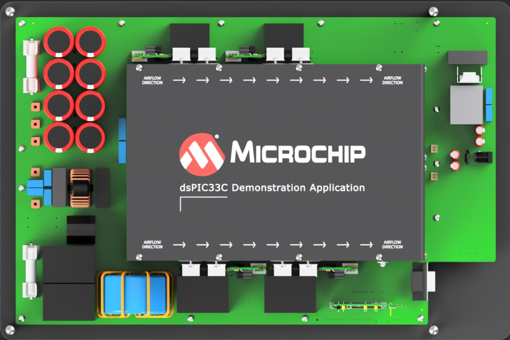

 

--- 
## dspic33ck Power DC-DC Dual Active Bridge Development Platform

<a target="_blank" rel="nofollow">

&nbsp; 

</a>

<a target="_blank" rel="nofollow">
dsPIC33C DAB Development Board
</a>

---

## Summary

The 11kW Dual Active Bridge (DAB) Application Demonstration, based on Microchip's dsPIC33C family and Silicon Carbide (SiC) devices, supports rapid prototyping and code development. 
The primary target application is automotive On-board charger (OBC), but it can be used for any other industrial or telecom application demanding high power, high voltage dynamic bidirectional power supplies.

---

## Description
This code example demonstrates the operation of a Dual Active Bridge with three loop controls comprised of outer voltage loop, inner current loop and power loop. 
The loop implementation also includes the required state machine managing board status analysis, start-up control, operation monitoring, and fault handling.

---

## Related Documentation

### Firmware Documentation

- [Online Firmware Documentation of this Code Example]()

### Hardware and Target Device Documentation

- [dsPIC33CK256MP508 Family Data Sheet](https://www.microchip.com/70005349)
- [dsPIC33CK256MP508 Family Silicon Errata and Data Sheet Clarification](https://www.microchip.com/80000796)

### Product websites

- [dsPIC33CK256MP508 Family](https://www.microchip.com/dsPIC33CK256MP508)
- [dsPIC33CH512MP508 Family](https://www.microchip.com/dsPIC33CH512MP508)
 
---

## Software Used

- [MPLAB&reg; X IDE v6.20](https://www.microchip.com/mplabx)
- [MPLAB&reg; XC-DSC Compiler v3.00](https://www.microchip.com/xc-dsc)

---

## Hardware Used

- [dsPIC33C DAB Development Board]()

---

## Supported Target Devices

### Focus Microchip Technology Devices

- [64-pin Digital Signal Controller, dsPIC33CK256MP506](https://www.microchip.com/dsPIC33CK256MP506)

### Further Microchip Technology Devices used in this Design

*a) Power Supply Circuit*

- [MCP6V91T-E/OT]()
- [PIC16F1764-E/ML]()
- [MIC2176-3YMM]()
- [MCP1801/3.3V]()
- [Active Thermistor Temperature Sensor, MCP9700](https://www.microchip.com/MCP9700)

*b) Protection Circuit*
Add here for DAB
- [P-Channel Enhancement-Mode MOSFET, TP2104](https://www.microchip.com/TP2104)
- [36V Open-Collector Comparator, MIC6270YM5](https://www.microchip.com/MIC6270)
- [Windowed Comparator with Adjustable Hysteresis, MIC841H](https://www.microchip.com/MIC841)
- [50V/5A Schottky-Diode, HSM560JE3](https://www.microsemi.com/existing-parts/parts/48587)

*c) Communication, Programming/Debugging and Housekeeping*
Add here for DAB
- [2-Port USB 2.0 HUB Controller, USB2422](https://www.microchip.com/USB2422)
- [USB 2.0 to I2C/UART Protocol Converter, MCP2221A](https://www.microchip.com/MCP2221A)
- [44-pin MCU PIC24FJ64GA004](https://www.microchip.com/PIC24FJ64GA004)

---

## Security and Safety Requirements

Unattended operating power supplies are always a potential safety risk as short circuits or failures of power components can occur at any time where even seemingly small power converters can cause fire or damage connected equipment.

- This development board has not been FCC approved nor certified and must not be used outside a laboratory environment
- Never operate the board unattended
- Only use power supplies delivered with the board or equal, approved laboratory equipment
- Read the user guide for detailed operating instructions to prevent damage to the board or connected equipment

---

## Setup

Ask Lorant for the test Set-up

<a target="_blank" rel="nofollow">

</a>

<a target="_blank" rel="nofollow">
Dual active Bridge Converter System Overview
</a>

## Operation

<a target="_blank" rel="nofollow">

</a>

<a target="_blank" rel="nofollow">
Power Board Visualizer 
</a>

After the device has been programmed and the target device starts up, the Power Board Visualizer will display the runtime data, showing the most recent input and output voltages, output current, temperature, 5V rail voltage, Fan speed, Switching period, power, the state being executed in the state machine along with the status flags. There are also parameters in the power board visualizer that the user can control like the voltage reference, current reference and power reference.   

### PWM Set-Up

In this application, the DAB's primary bridge is drive by PWM1 (for P1 and P2) and PWM3 (for P3 and P4) while the secondary bridge where drive by PWM2 (for S1 and S2) and PWM4 (for S3 and S4).
Each PWMs run in complementary mode, with PWM2 and PWM4 with swapped output. 

PWMs are also configured in a cascaded way where the first PWM triggers the next PWM successively. This approach broadcasts a single PWM update, thus ensuring that the PWMs are updated in the same cycle. 
PWM1 is a master PWM while PWM2, PWM3, and PWM4 are the secondary PWMs that follows the PWM1. The PWM4 which is the last PWM in the cascaded sequence broadcast the Update bit to all PWMs. 

<a target="_blank" rel="nofollow">

&nbsp; 

</a>

<a target="_blank" rel="nofollow">
Dual active Bridge simplified schematic and PWM signals
</a>

Theoretically, DAB is controlled by changing the phase of the bridges, often reffered as the <b>Control Phase</b>. In primary bridge, the phase shift between two half bridges is referred as <b>Primary Phase</b>, while in secondary bridge, the phase shift between two bridges is reffered as <b>Secondary Phase</b>.
The <b>Primary To Secondary Phase</b> is the phase shift between the primary bridge and secondary bridge.

The following equations for PWM phases where used to control the DAB converter. It is the PWM trigger that defines the control phase of the DAB converter.

		Primary Phase = Control Phase
		Secondary Phase = Control Phase
		Primary To Secondary Phase = 90 degrees - (Control Phase / 2)

### Start-Up Sequence
<i>add content here</i>

### Control Loop 

<a target="_blank" rel="nofollow">

</a>

<a target="_blank" rel="nofollow">
Dual Active Bridge Control Loop
</a>

This figure depicts the block diagram of the DAB converter 

---

&copy; 2024, Microchip Technology Inc.

---

### Footnotes

